# 변경사항

### E-1

반응형 데이터 정의: 자동 반응형(this로 접근) -> 명시적으로 ref() 사용  
데이터 접근: this -> .value 
script setup 사용: export default와 setup() 함수 제거  
name 속성 제거: 파일명으로 자동 추론 

### E-2

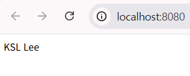

computed 속성: 객체 내에 함수로 정의, this로 접근 -> computed() 함수 import해서 사용, .value로 ref값에 접근  
라이프사이클 훅: mounted 옵션으로 정의, this로 접근 -> onmounted()를 import해서 사용, .value로 ref값 변경 

### E-3

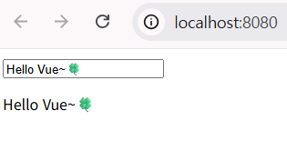

반응형 데이터 정의: 자동 반응형(this로 접근) -> 명시적으로 ref() 사용  
데이터 접근: this -> .value 

### E-4

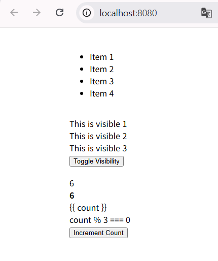

반응형 데이터 정의: 자동 반응형(this로 접근) -> 명시적으로 ref() 사용  
데이터 접근: this -> .value 
name 속성 제거: 파일명으로 자동 추론 

### E-5

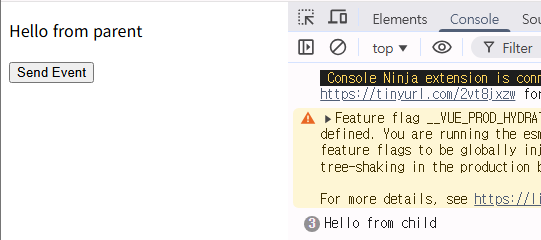

ChildComponent1  

- props 정의 방식: 배열 형태, 타입 미지정 -> 객체 형태, 타입 명시
- 이벤트 발생 방식: emit 직접 사용 -> emit 함수를 변수로 사용
- 타입 안정성: props.message 어떤 타입이든 허용 -> string 타입만 허용

ParentComponent  

- 반응형 데이터 정의: 자동 반응형(this로 접근) -> 명시적으로 ref() 사용(스크립트:.value로 접근, 템플릿: 자체로 접근)
- 메서드 정의: this로 접근 -> this 바인딩 불필요
- 컴포넌트 등록: 명시적 등록 -> import만으로 자동 등록
- name 속성 제거: 파일명으로 자동 추론

### E-6

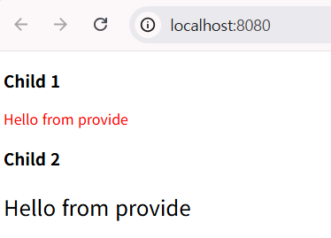

ChildComponent1  

- 컴포넌트 등록 방식: 명시적으로 등록 -> 자동 등록
- inject 사용 방식: 배열 형태로 선언 -> 함수 호출로 가져와 변수에 직접 할당
- script setup 사용: export default와 setup() 함수 제거

ChildComponent2  

- inject 사용 방식: 배열 형태로 선언 -> 함수 호출로 가져와 변수에 직접 할당

ParentComponent

- provide 사용 방식: 객체 형태로 반환 -> import 후 함수로 직접 호출
- 컴포넌트 등록: 명시적 등록 -> import만으로 자동 등록
- name 속성 제거: 파일명으로 자동 추론

### E-7

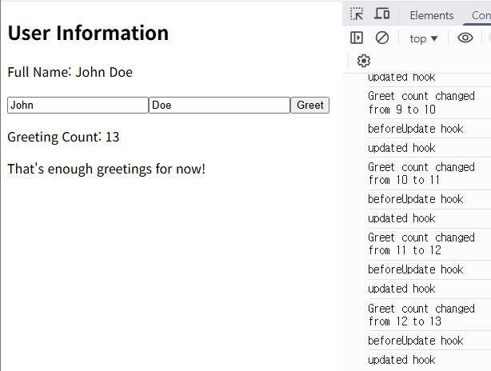

반응형 데이터 정의 : 명시적으로 ref() 사용
데이터 접근 방식: this 사용 -> .value 사용

### E-8

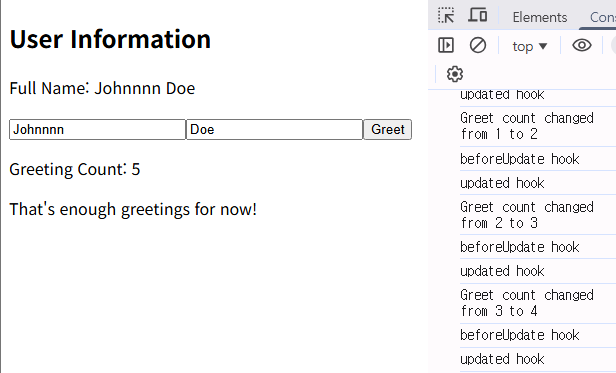

props 정의 방식: setup 함수의 매개변수로 받는 것에서 변경 
return문 제거: 최상위 변수와 함수가 자동으로 템플릿에 노출되어 명시적으로 반환하지 않아도 됨 
name 속성 제거: 파일명으로 자동 추론

### E-9

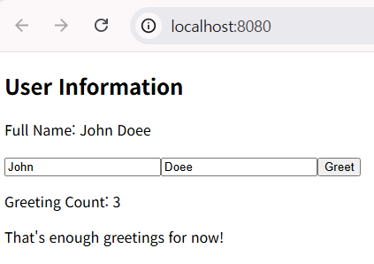

name 속성 제거: 파일명으로 자동 추론
script setup 사용: export default와 setup() 함수 제거  

### E-10

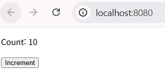

script setup 사용: export default와 setup() 함수 제거  
return문 제거: 최상위 변수와 함수가 자동으로 템플릿에 노출되어 명시적으로 반환하지 않아도 됨 
name 속성 제거: 파일명으로 자동 추론

### E-11

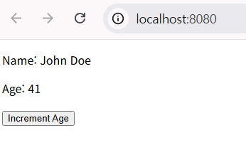

script setup 사용: export default와 setup() 함수 제거  
return문 제거: 최상위 변수와 함수가 자동으로 템플릿에 노출되어 명시적으로 반환하지 않아도 됨 
name 속성 제거: 파일명으로 자동 추론

### E-12

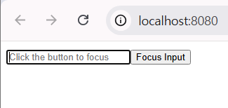

script setup 사용: export default와 setup() 함수 제거  
return문 제거: 최상위 변수와 함수가 자동으로 템플릿에 노출되어 명시적으로 반환하지 않아도 됨 
name 속성 제거: 파일명으로 자동 추론
